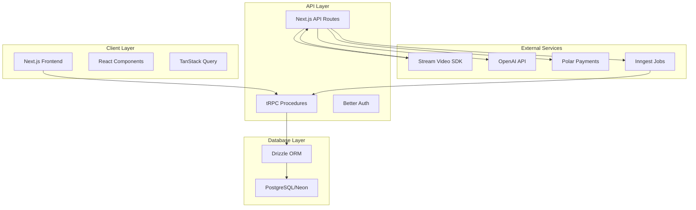

# Design Document

## Overview

Meet AI is a modern SaaS platform built with Next.js 15 that enables real-time video conversations with custom AI agents. The architecture leverages serverless infrastructure, third-party services for video/AI capabilities, and a robust background job system for post-call processing. The platform follows a multi-tenant design where users can create multiple AI agents and conduct unlimited meetings within their subscription limits.

## Architecture

### High-Level Architecture



### System Components

1. **Frontend Application**: Next.js 15 with React 19, TypeScript, and Tailwind CSS
2. **API Layer**: tRPC for type-safe APIs, Next.js API routes for webhooks
3. **Authentication**: Better Auth with email/password and OAuth support
4. **Database**: PostgreSQL via Neon with Drizzle ORM
5. **Video Infrastructure**: Stream Video SDK for WebRTC calls
6. **AI Processing**: OpenAI Realtime API for agent interactions
7. **Background Jobs**: Inngest for post-call processing
8. **Payments**: Polar for subscription management

## Components and Interfaces

### Frontend Components

#### Authentication Components

- `LoginForm`: Email/password and social login interface
- `RegisterForm`: User registration with validation
- `AuthGuard`: Route protection wrapper
- `UserProfile`: Profile management interface

#### Agent Management Components

- `AgentList`: Paginated list with search functionality
- `AgentForm`: Create/edit agent with instructions
- `AgentCard`: Individual agent display with actions
- `AgentDetails`: Detailed view with meeting history

#### Meeting Components

- `MeetingList`: Filterable meeting dashboard
- `MeetingForm`: Create meeting with agent selection
- `MeetingCard`: Status-aware meeting display
- `MeetingDetails`: Comprehensive meeting view with tabs

#### Video Call Components

- `VideoLobby`: Pre-call device testing interface
- `CallInterface`: In-call controls and video display
- `CallControls`: Camera, microphone, and end call buttons
- `AIAgentDisplay`: Visual representation of AI participant

#### Post-Call Components

- `MeetingSummary`: AI-generated summary display
- `TranscriptViewer`: Searchable transcript with timestamps
- `VideoPlayer`: Recording playback with controls
- `AIChat`: Q&A interface for meeting context

#### Subscription Components

- `SubscriptionStatus`: Current tier and usage display
- `UpgradePage`: Tier comparison and selection
- `PaymentFlow`: Integration with Polar checkout

### Backend API Design

#### tRPC Router Structure

```typescript
export const appRouter = router({
  // Public procedures
  hello: publicProcedure.query(() => 'Hello World'),

  // Protected procedures
  agents: router({
    getMany: protectedProcedure
      .input(
        z.object({
          page: z.number().default(1),
          limit: z.number().default(10),
          search: z.string().optional(),
        })
      )
      .query(async ({ input, ctx }) => {
        // Paginated agent retrieval with search
      }),

    create: protectedProcedure
      .input(
        z.object({
          name: z.string().min(1).max(255),
          instructions: z.string().min(1),
        })
      )
      .mutation(async ({ input, ctx }) => {
        // Create agent with validation
      }),

    getOne: protectedProcedure
      .input(z.object({ id: z.string() }))
      .query(async ({ input, ctx }) => {
        // Fetch single agent with ownership check
      }),

    update: protectedProcedure
      .input(
        z.object({
          id: z.string(),
          name: z.string().min(1).max(255),
          instructions: z.string().min(1),
        })
      )
      .mutation(async ({ input, ctx }) => {
        // Update agent with validation
      }),

    remove: protectedProcedure
      .input(z.object({ id: z.string() }))
      .mutation(async ({ input, ctx }) => {
        // Delete agent with cascade handling
      }),
  }),

  meetings: router({
    getMany: protectedProcedure
      .input(
        z.object({
          page: z.number().default(1),
          limit: z.number().default(10),
          status: z
            .enum([
              'upcoming',
              'active',
              'completed',
              'processing',
              'cancelled',
            ])
            .optional(),
          agentId: z.string().optional(),
          search: z.string().optional(),
        })
      )
      .query(async ({ input, ctx }) => {
        // Filtered meeting retrieval
      }),

    create: protectedProcedure
      .input(
        z.object({
          name: z.string().min(1).max(255),
          agentId: z.string(),
        })
      )
      .mutation(async ({ input, ctx }) => {
        // Create meeting and Stream call
      }),

    generateToken: protectedProcedure
      .input(z.object({ meetingId: z.string() }))
      .mutation(async ({ input, ctx }) => {
        // Generate Stream user token
      }),
  }),
});
```

#### Webhook Handlers

```typescript
// /api/webhook/stream
export async function POST(request: Request) {
  const signature = request.headers.get('stream-signature');
  const body = await request.text();

  // Validate webhook signature
  if (!validateStreamSignature(signature, body)) {
    return new Response('Unauthorized', { status: 401 });
  }

  const event = JSON.parse(body);

  switch (event.type) {
    case 'call.session_started':
      await handleCallStarted(event);
      break;
    case 'call.session_ended':
      await handleCallEnded(event);
      break;
    case 'call.transcription_ready':
      await handleTranscriptionReady(event);
      break;
    case 'call.recording_ready':
      await handleRecordingReady(event);
      break;
  }

  return new Response('OK');
}
```

## Data Models

### Database Schema

#### Users Table

```sql
CREATE TABLE users (
  id UUID PRIMARY KEY DEFAULT gen_random_uuid(),
  name VARCHAR(255),
  email VARCHAR(255) UNIQUE NOT NULL,
  email_verified BOOLEAN DEFAULT FALSE,
  subscription_tier VARCHAR(50) DEFAULT 'free_trial',
  subscription_expires_at TIMESTAMP,
  created_at TIMESTAMP DEFAULT NOW(),
  updated_at TIMESTAMP DEFAULT NOW()
);
```

#### Agents Table

```sql
CREATE TABLE agents (
  id VARCHAR(21) PRIMARY KEY, -- nano ID
  name VARCHAR(255) NOT NULL,
  user_id UUID REFERENCES users(id) ON DELETE CASCADE,
  instructions TEXT NOT NULL,
  avatar_seed VARCHAR(255), -- for DiceBear generation
  created_at TIMESTAMP DEFAULT NOW(),
  updated_at TIMESTAMP DEFAULT NOW(),

  UNIQUE(user_id, name) -- Unique agent names per user
);
```

#### Meetings Table

```sql
CREATE TABLE meetings (
  id VARCHAR(21) PRIMARY KEY, -- nano ID
  name VARCHAR(255) NOT NULL,
  user_id UUID REFERENCES users(id) ON DELETE CASCADE,
  agent_id VARCHAR(21) REFERENCES agents(id) ON DELETE CASCADE,
  stream_call_id VARCHAR(255) UNIQUE, -- Stream call identifier
  status VARCHAR(20) DEFAULT 'upcoming' CHECK (status IN ('upcoming', 'active', 'completed', 'processing', 'cancelled')),
  started_at TIMESTAMP,
  ended_at TIMESTAMP,
  duration_seconds INTEGER,
  transcript_url TEXT,
  recording_url TEXT,
  summary TEXT,
  created_at TIMESTAMP DEFAULT NOW(),
  updated_at TIMESTAMP DEFAULT NOW()
);
```

#### Sessions & Auth Tables

```sql
CREATE TABLE sessions (
  id UUID PRIMARY KEY DEFAULT gen_random_uuid(),
  user_id UUID REFERENCES users(id) ON DELETE CASCADE,
  expires_at TIMESTAMP NOT NULL,
  created_at TIMESTAMP DEFAULT NOW()
);

CREATE TABLE accounts (
  id UUID PRIMARY KEY DEFAULT gen_random_uuid(),
  user_id UUID REFERENCES users(id) ON DELETE CASCADE,
  provider VARCHAR(50) NOT NULL,
  provider_account_id VARCHAR(255) NOT NULL,
  access_token TEXT,
  refresh_token TEXT,
  expires_at TIMESTAMP,
  created_at TIMESTAMP DEFAULT NOW(),

  UNIQUE(provider, provider_account_id)
);
```

### TypeScript Interfaces

```typescript
// Core domain models
interface User {
  id: string;
  name: string | null;
  email: string;
  emailVerified: boolean;
  subscriptionTier: 'free_trial' | 'basic' | 'pro' | 'enterprise';
  subscriptionExpiresAt: Date | null;
  createdAt: Date;
  updatedAt: Date;
}

interface Agent {
  id: string;
  name: string;
  userId: string;
  instructions: string;
  avatarSeed: string;
  createdAt: Date;
  updatedAt: Date;
  _count?: {
    meetings: number;
  };
}

interface Meeting {
  id: string;
  name: string;
  userId: string;
  agentId: string;
  streamCallId: string | null;
  status: 'upcoming' | 'active' | 'completed' | 'processing' | 'cancelled';
  startedAt: Date | null;
  endedAt: Date | null;
  durationSeconds: number | null;
  transcriptUrl: string | null;
  recordingUrl: string | null;
  summary: string | null;
  createdAt: Date;
  updatedAt: Date;
  agent?: Agent;
}

// API response types
interface PaginatedResponse<T> {
  data: T[];
  pagination: {
    page: number;
    limit: number;
    total: number;
    totalPages: number;
  };
}

interface TranscriptEntry {
  timestamp: number;
  speaker: 'user' | 'agent';
  text: string;
}
```

## Error Handling

### Client-Side Error Handling

```typescript
// Global error boundary
export function GlobalErrorBoundary({ children }: { children: React.ReactNode }) {
  return (
    <ErrorBoundary
      FallbackComponent={ErrorFallback}
      onError={(error, errorInfo) => {
        console.error('Global error:', error, errorInfo);
        // Send to error tracking service
      }}
    >
      {children}
    </ErrorBoundary>
  );
}

// API error handling with TanStack Query
export function useAgents() {
  return useQuery({
    queryKey: ['agents'],
    queryFn: () => trpc.agents.getMany.query(),
    retry: (failureCount, error) => {
      // Don't retry on 4xx errors
      if (error instanceof TRPCError && error.data?.httpStatus < 500) {
        return false;
      }
      return failureCount < 3;
    },
    onError: (error) => {
      toast.error('Failed to load agents');
    }
  });
}
```

### Server-Side Error Handling

```typescript
// tRPC error handling
export const protectedProcedure = publicProcedure.use(async ({ ctx, next }) => {
  if (!ctx.user) {
    throw new TRPCError({
      code: 'UNAUTHORIZED',
      message: 'Authentication required',
    });
  }

  return next({
    ctx: {
      ...ctx,
      user: ctx.user,
    },
  });
});

// Webhook error handling
export async function handleCallEnded(event: StreamWebhookEvent) {
  try {
    const meeting = await db.query.meetings.findFirst({
      where: eq(meetings.streamCallId, event.call.id),
    });

    if (!meeting) {
      console.warn(`Meeting not found for call ${event.call.id}`);
      return;
    }

    await db
      .update(meetings)
      .set({
        status: 'processing',
        endedAt: new Date(),
        updatedAt: new Date(),
      })
      .where(eq(meetings.id, meeting.id));

    // Dispatch background job
    await inngest.send({
      name: 'meetings/process-completion',
      data: { meetingId: meeting.id },
    });
  } catch (error) {
    console.error('Error handling call ended:', error);
    // Don't throw - webhook should return 200
  }
}
```

## Testing Strategy

### Unit Testing

- **Components**: Test rendering, user interactions, and state management
- **API Procedures**: Test business logic, validation, and error cases
- **Utilities**: Test helper functions and data transformations
- **Coverage Target**: 80% minimum

### Integration Testing

- **API Endpoints**: Test complete request/response cycles
- **Database Operations**: Test CRUD operations and constraints
- **Authentication Flow**: Test login, registration, and session management
- **Webhook Processing**: Test event handling and state updates

### End-to-End Testing

- **User Workflows**: Test complete user journeys from registration to meeting completion
- **Video Call Flow**: Test lobby → call → post-call intelligence
- **Subscription Flow**: Test free trial → upgrade → payment
- **Cross-Browser**: Test on Chrome, Firefox, Safari, Edge

### Performance Testing

- **Load Testing**: Simulate concurrent users and meetings
- **API Performance**: Measure response times under load
- **Database Performance**: Test query performance with large datasets
- **Video Call Quality**: Test with multiple concurrent calls

### Testing Tools

- **Unit/Integration**: Vitest with React Testing Library
- **E2E**: Playwright for cross-browser testing
- **API Testing**: Supertest for HTTP endpoint testing
- **Performance**: Artillery for load testing
- **Visual Regression**: Percy for UI consistency

## Security Considerations

### Authentication & Authorization

- Password hashing with bcrypt (minimum 10 rounds)
- JWT tokens for session management with secure httpOnly cookies
- OAuth 2.0 for social login with proper scope validation
- Rate limiting on authentication endpoints (5 attempts per minute)

### Data Protection

- HTTPS/TLS 1.3 for all communications
- Database connection encryption
- Environment variable security (no client-side exposure)
- Input validation and sanitization on all endpoints

### API Security

- tRPC procedures with Zod schema validation
- CORS configuration for allowed origins
- Webhook signature validation for Stream events
- SQL injection prevention via parameterized queries

### Video Call Security

- Stream SDK handles WebRTC security
- User tokens with limited scope and expiration
- Call access restricted to meeting participants
- Recording/transcript access limited to meeting owner

## Deployment Architecture

### Infrastructure

- **Hosting**: Vercel for Next.js application
- **Database**: Neon PostgreSQL with connection pooling
- **CDN**: Vercel Edge Network for static assets
- **Monitoring**: Vercel Analytics + custom error tracking

### Environment Configuration

```typescript
// Environment variables
interface Env {
  DATABASE_URL: string;
  NEXTAUTH_SECRET: string;
  STREAM_API_KEY: string;
  STREAM_API_SECRET: string;
  OPENAI_API_KEY: string;
  POLAR_ACCESS_TOKEN: string;
  INNGEST_EVENT_KEY: string;
  INNGEST_SIGNING_KEY: string;
}
```

### CI/CD Pipeline

1. **Code Quality**: ESLint, Prettier, TypeScript checks
2. **Testing**: Unit, integration, and E2E test suites
3. **Security**: Dependency vulnerability scanning
4. **Build**: Next.js production build with optimization
5. **Deploy**: Automatic deployment to Vercel on main branch
6. **Monitoring**: Post-deployment health checks

This design provides a scalable, maintainable architecture that addresses all the requirements while leveraging modern web technologies and best practices.
